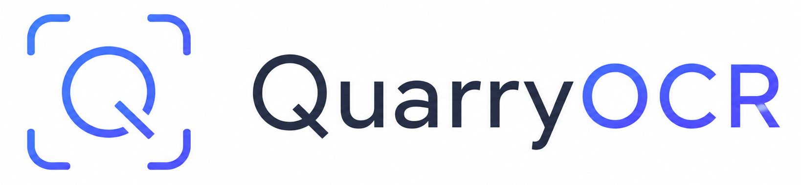
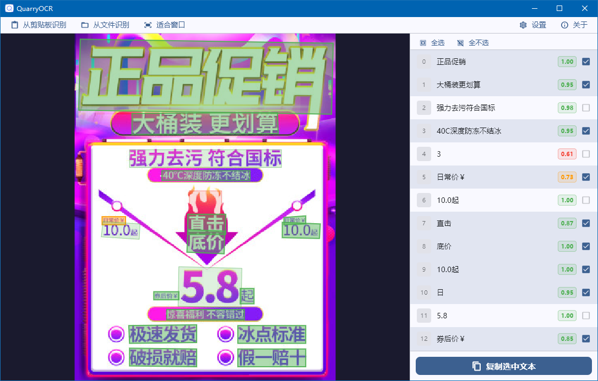

    
     
    

        
        
    	
        
    

## 🚩 简介
一个兼容 RapidOCR API 规范的轻量级 OCR 桌面前端，具有如下特性：
- [x] 纯前端界面，不集成 OCR 推理引擎及模型，与推理后端完全解耦。可兼容任何符合 RapidOCR API 规范的 OCR 推理后端，方便任意替换推理引擎及模型，或将后端部署至远程高性能推理设备。
- [x] 基于 Flutter 框架轻量实现，专注于基本的图片 OCR，支持从剪贴板或文件识别，无任何冗余功能。
- [x] 支持可视化交互式选择需要复制的候选框，仅复制需要的识别结果。候选框以不同颜色显示识别置信度。
## 💻 演示

## 🔑 使用方法
1. 部署一个符合 RapidOCR API 规范的 OCR 推理后端，可选择如下后端，部署方法见对应文档：
   
   |名称|说明|仓库地址|文档|
   |----|-----|-------|----|
   |RapidOCRAPI|RapidOCR 官方实现|[RapidAI/RapidOCRAPI](https://github.com/RapidAI/RapidOCRAPI)|[查看](https://rapidai.github.io/RapidOCRDocs/latest/install_usage/rapidocr_api/usage/)
   |RapidOCRServer|基于官方实现重构，支持硬件加速|[XJTU-WXY/RapidOCRServer](https://github.com/XJTU-WXY/RapidOCRServer)|[查看](https://github.com/XJTU-WXY/RapidOCRServer/blob/master/README.md)
2. 在 QuarryOCR 设置界面中填写推理 API 并保存设置，若推理后端以默认参数在本机运行，则无需修改。
3. 通过剪贴板或文件读入图片，若 API 配置正确，则会在左侧展示识别结果候选框，右侧展示识别结果文本。
4. 点选需要的候选框，支持按住鼠标左键批量选择、鼠标滚轮缩放、鼠标右键拖动，并点击`复制选中文本`。
## 📅 TODO
- [ ] 支持多平台（Linux、macOS）
- [ ] 支持多国语言

## ⚖ 开源协议
本项目基于 [GNU General Public License v3.0](https://www.gnu.org/licenses/gpl-3.0.html) 开源.
  
*Open source leads the world to a brighter future!*
